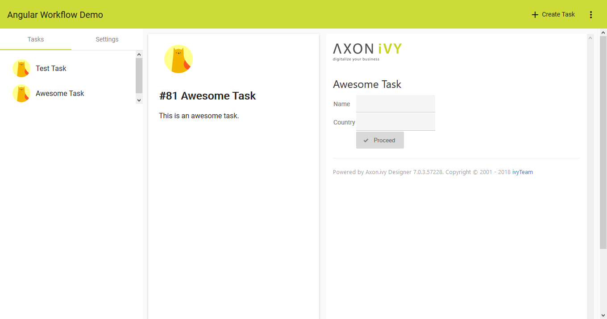

# Axon.ivy Angular Demo

Demonstrates how Axon.ivy can be used in conjunction with client-side JavaScript Frameworks like Angular, React.

Beta

## Technologies
* Backend: Axon.ivy Digital Business Platform 7.0 and later
* Frontend: Angular 5 + Material Design

## Requirements
* Axon.ivy Designer
* Node.js 
* npm or yarn
* Angular Cli: `npm install -g @angular/cli`

## Building the Angular SPA
Build the code for the integration into the ivy Project with:

    cd spa/
    npm install
    npm run build-prod

## Running the ivy Project
After building you can import the ivy project `AngularWfDemo` into the Axon.ivy Designer (do not copy the project to the workspace to keep the project side-by-side with the spa project folder) and open the `StartDemo` process to see how to start the Angular based web frontend. Via "Create Task" you can trigger a REST request in ivy that will create a new ivy task, which will be displayed in the task list of the SPA and of the designer. These tasks have a HTML Dialog attached which is displayed inside an iframe.

## Development
The backend in the `AngularWfDemo` can be developed with the Axon.ivy Designer. To access the provided REST services while developing the ivy Designer needs to be started and running on Port 8081.

The frontend in the `spa/` folder can be developed with any IDE/Editor suited for TypeScript development (e.g. VS Code). Run following command in the `spa/` folder to start the development server:

    npm start

Access the SPA on http://localhost:4200/.

(Requests to http://localhost:4200/ivy/ are proxied to http://localhost:8081/ivy/)

## Troubleshooting
* If a Basic Authentication dialog pops up use following test credentials: user/user.
* If a file like angular/index.html is not found you will most likely have to build the SPA first. (It will output the built SPA to `/webContent/angular/`)